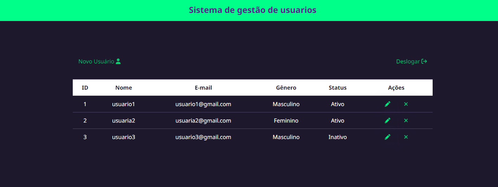
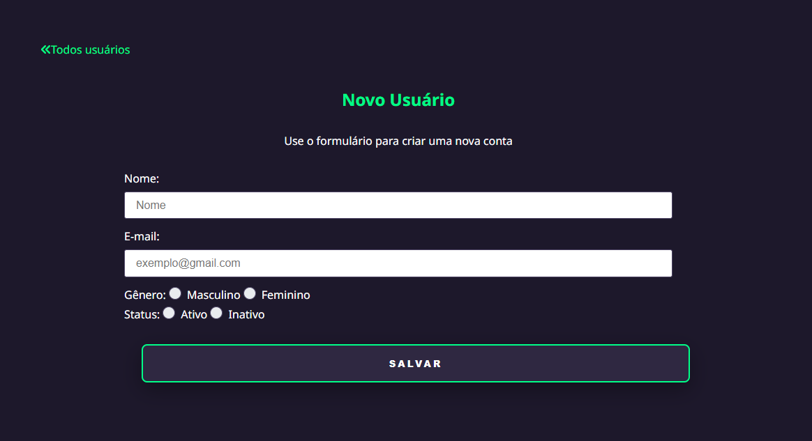

# Sistema de gestão de usuarios   [](https://opensource.org/licenses/MIT)


# Sobre o projeto


O sistema de gestão de usuarios é uma aplicação CRUD construída em NodeJS, Express, Sequelize e Front-end basico 

A aplicação consiste em uma interface que permite ao gestor logado adicionar, editar e remover os usuarios que ele deseja, cada gestor possui seus propios usuarios


# Layout
##  Login   


##  Home page   



##  Criar usuario   



# Tecnologias utilizadas
## Back end
- NodeJS
- Express
- Express-session
- Sequelize
- SQL
## Front end
- HTML / CSS / JS 
- EJS


# Como executar o projeto

Pré-requisitos: npm / yarn

```bash

# Retornar ao diretório inicial
cd

# Criar diretório do projeto
mkdir crudproject

# Ir para o diretório do projeto
cd crudproject

# entrar na pasta do projeto
cd crudproject

# clonar repositório
git clone https://github.com/lucaseduardo-meira/crudproject

# instalar dependências
yarn install

# executar o projeto
yarn start

# Projeto estará rodando na port:3000
http://localhost:3000/
```

# Autor

Lucas Eduardo Meira

http://www.linkedin.com/in/lucas-eduardo-meira
